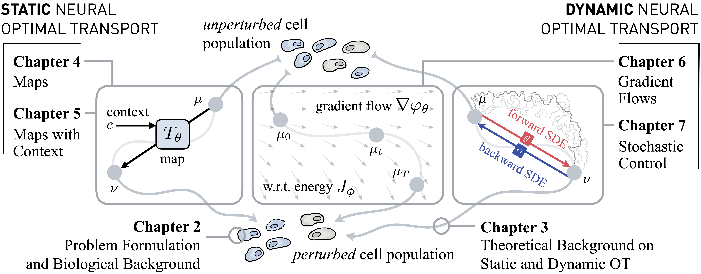

# Neural Optimal Transport for Dynamical Systems
## Methods and Applications in Biomedicine

**PhD Thesis, ETH Zurich, 2023.**

 

Modeling dynamical systems is a core subject of many scientific disciplines as it allows us to predict future states, understand complex interactions over time, and enable informed decision-making. Biological systems in particular are governed by dynamical processes, with their inherently complex and constantly changing patterns of interactions and behaviors. Single-cell biology has revolutionized biomedical research, as it allows us to monitor such systems at unprecedented scales. At the same time, it presents us with formidable challenges: While single-cell high-throughput methods routinely produce millions of data points, they are destructive assays, such that the same cell cannot be observed twice nor profiled over time. Since many of the most pressing questions in the field involve modeling the dynamic responses of heterogeneous cell populations to various stimuli, such as therapeutic drugs or developmental signals, there is a pressing need to provide computational methods that can circumvent that limitation and re-align these unpaired measurements. Optimal transport (OT) has emerged as a major opportunity to fill in that gap in silico as it allows us to reconstruct how a distribution evolves, given only access to distinct snapshots of unaligned data points. Classical OT methods, however, do not generalize to unseen samples. Yet, this is crucial when, for example, predicting treatment responses of incoming patient samples or extrapolating cellular dynamics beyond the measured horizon. By harnessing the theoretical constructs of OT, this thesis explores and develops neural static and dynamic optimal transport schemes for elucidating the intricate dynamics of biological populations. It encapsulates an array of algorithmic frameworks, with contributions to both the understanding and prediction of population dynamics:
 First, we derive static neural optimal transport schemes capable of learning a map between the unpaired distributions of unperturbed and perturbed cells. These models excel at predicting single-cell responses to varying perturbations, such as cancer drug screens, and generalize the inference of treatment outcomes to unobserved cell types and patients. This has significant implications for personalized medicine, as it allows for the prediction of treatment responses for new patients in large-scale clinical studies. Second, we explore dynamic neural optimal transport formulations that leverage the connections of OT to partial differential equation and gradient flows through the Jordan-Kinderlehrer-Otto scheme, as well as stochastic differential equations and optimal control through the diffusion Schrödinger bridge. These methods then serve as robust tools for reconstructing stochastic and continuous-time dynamics from marginal observations, allowing us to dissect fine-grained and time-resolved cellular mechanisms.
 This thesis connects a variety of seemingly unrelated concepts into a unified framework, and the presented methodologies offer a computational and mathematical foundation for modeling of cellular dynamics. This provides new avenues to understand cellular heterogeneity, plasticity, and response landscapes. Such neural parameterizations of static and dynamic OT that allow for out-of-sample inference lay the groundwork for exciting opportunities to make novel biological discoveries, infer personalized therapies from single-cell patient samples, and push the boundaries of regenerative medicine. 

### Overview of Contents
All results presented in this thesis have been published in the following conference proceedings and journals:

- Charlotte Bunne, Laetitia Meng-Papaxanthos, Andreas Krause, and Marco Cuturi. [Proximal Optimal Transport Modeling of Population Dynamics](https://proceedings.mlr.press/v151/bunne22a/bunne22a.pdf). In *International Conference on Artificial Intelligence and Statistics (AISTATS)*, volume 25, 2022.
- Charlotte Bunne, Andreas Krause, and Marco Cuturi. [Supervised Training of Conditional Monge Maps](https://openreview.net/pdf?id=sPNtVVUq7wi). In *Advances in Neural Information Processing Systems (NeurIPS)*, volume 35, 2022.
- Charlotte Bunne, Ya-Ping Hsieh, Marco Cuturi, and Andreas Krause. [The Schrödinger Bridge between Gaussian Measures has a Closed Form](https://proceedings.mlr.press/v206/bunne23a/bunne23a.pdf). In *International Conference on Artificial Intelligence and Statistics (AISTATS)*, volume 206, 2023.
- Vignesh Ram Somnath, Matteo Pariset, Ya-Ping Hsieh, Maria Rodriguez Martinez, Andreas Krause, and Charlotte Bunne. [Aligned Diffusion Schrödinger Bridges](https://openreview.net/pdf?id=BkWFJN7_bQ). In *Conference on Uncertainty in Artificial Intelligence (UAI)*, 2023.
- Charlotte Bunne, Stefan G Stark, Gabriele Gut, Jacobo Sarabia del Castillo, Kjong-Van Lehmann, Lucas Pelkmans, Andreas Krause, and Gunnar Rätsch. [Learning Single-Cell Perturbation Responses using Neural Optimal Transport](https://www.researchsquare.com/article/rs-1805107/v1). *Nature Methods*, 2023.

### License

[GPLv2](https://opensource.org/licenses/GPL-2.0) inherited from
[ClassicThesis](https://www.ctan.org/tex-archive/macros/latex/contrib/classicthesis/).
Adapted the template by [Tino Wagner](http://www.tinowagner.com/).

### Contact

In case you have questions, reach out to `bunnec@ethz.ch`.
